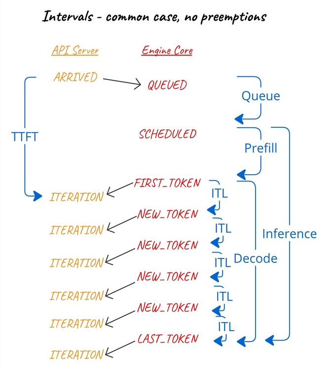
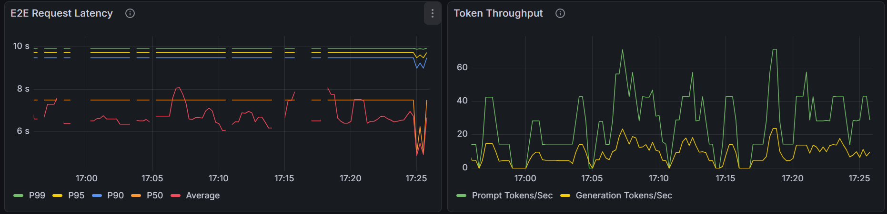
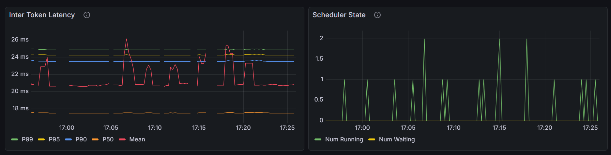
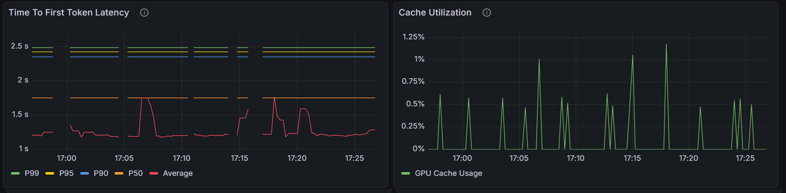
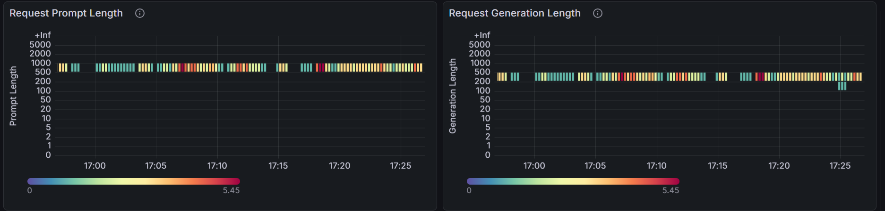
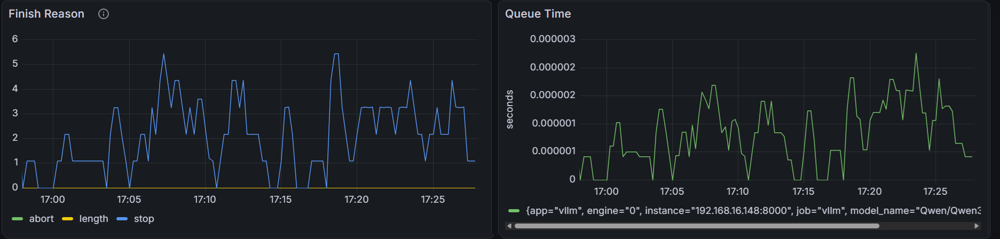
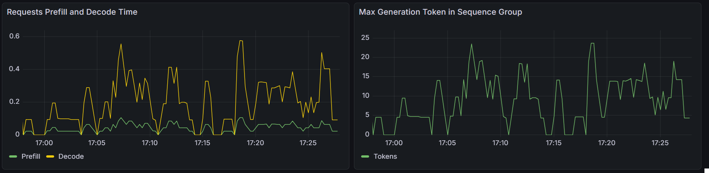
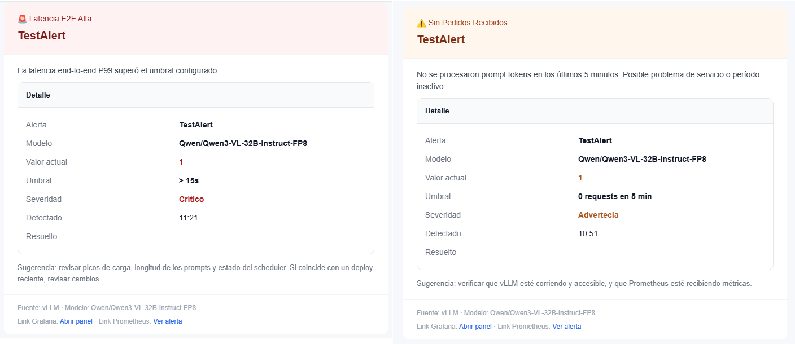
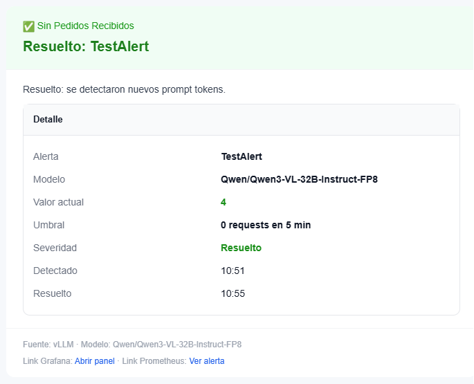

# Monitoreador de métricas de vLLM
Este proyecto consiste en, por medio de un servidor Prometheus, vincular las métricas del servidor 192.168.16.148:8000 a un dashboard de Grafana, así como generar alertas que notifiquen cuando las métricas se comportan de forma extraña. Las alertas son configuradas usando AlertManager.

Guia para la implementación: [2. Lista de cambios para la implementación](#2-lista-de-cambios-para-la-implementación)
## Tabla de contenidos
- [Monitoreador de métricas de vLLM](#monitoreador-de-métricas-de-vllm)
  - [Tabla de contenidos](#tabla-de-contenidos)
  - [1. Detalles del monitoreador](#1-detalles-del-monitoreador)
    - [1.1. Servidor Prometheus](#11-servidor-prometheus)
      - [1.1.1. Parametros](#111-parametros)
    - [1.2. Dashboard](#12-dashboard)
    - [1.3. Alertas](#13-alertas)
      - [1.3.1. Reglas de alertas](#131-reglas-de-alertas)
      - [1.3.2. Notificaciones](#132-notificaciones)
      - [1.3.3. Pausar alertas (mute alerts)](#133-pausar-alertas-mute-alerts)
    - [1.4. Estructura del directorio del proyecto](#14-estructura-del-directorio-del-proyecto)
  - [2. Lista de cambios para la implementación](#2-lista-de-cambios-para-la-implementación)
    - [2.1. templates/vllm\_alerts.tmpl](#21-templatesvllm_alertstmpl)
    - [2.2. alertmanager.yml](#22-alertmanageryml)
    - [2.3. docker-compose.yml](#23-docker-composeyml)
    - [2.4 password.txt](#24-passwordtxt)
## 1. Detalles del monitoreador
### 1.1. Servidor Prometheus
El servidor Prometheus conecta las métricas del vLLM con Grafana y AlertManager.

El servidor de Prometheus guarda un registro de las métricas durante 90 días, o hasta que los datos del registro alcancen los 50GB de almacenamiento.
#### 1.1.1. Parametros
1. scrape_interval: 5s. Frecuencia en la que Prometheus importa las métricas desde el vLLM
2. evaluation_interval: 30s. Frecuencia en la que Prometheus evalua las reglas de las alertas en alert_rules.yml
### 1.2. Dashboard


Fuente de la imagen: https://docs.vllm.ai/en/stable/design/metrics/#engine-core-events

El dashboard contiene 12 gráficos:
1. E2E Request Latency: Latencia end-to-end de los requests. Presenta la latencia en P50, P90, P95 y P99; así como la latencia en promedio 
2. Token Throughput: Número de tokens procesados en promedio
3. Inter Token Latency: Inter token latency en segundos
4. Scheduler State: Número de requests en estado RUNNING y WAITING
5. Time To First Token Latency: P50, P90, P95, P99 TTFT latency, así como la latencia en promedio, en segundos
6. Cache Utilization: Porcentaje de bloques de caché utilizados por vLLM
7. Request Prompt Lenght: Heatmap de Request Prompt Length
8. Request Generation Lenght: Heatmap de Request Generation Length
9. Finish Reason: Número de requests terminados, clasificados por su motivo de finalización: si un EOS token fue generado o se alcanzó la longitud máxima de la sequencia 
10. Queue Time
11. Requests Prefill and Decode Time
12. Max Generation Token in Sequence Group






### 1.3. Alertas
El monitoreador contiene dos alertas, que son notificadas a una dirección de correo cuando se activan.
#### 1.3.1. Reglas de alertas
| Alerta | Resumen | Descripción | Severidad | Valores normales |
|---|---|---|---|---|
| Brecha | No se recibieron requests durante 10 minutos | No se ha procesado ningún prompt tokens en los últimos 10 minutos - posible problema de servicio o periodo inactivo | Warning | Mayor a 0 (hay requests) |
| LatenciaE2EAlta | Se detectó un pico la latencia End-to-End durante 1 minuto | La latencia de P99 E2E fue mayor a 14s por más de 1 minuto | Critical | Latencia de P99 E2E = 9.95s |
#### 1.3.2. Notificaciones


| Parámetro | Implementación | Pruebas | Explicación |
|---|---|---|---|
| group_wait | 2m | 1m | El tiempo que Alertmanager espera después de recibir la primera alerta antes de mandar la notificación Esto permite que multiples alertas que se disparan al mismo tiempo sean agrupadas en un único correo en lugar de enviar un correo por alerta |
| group_interval | 10m | 2m | Después de que la primera notificación es enviada, group_interval indica cuánto tiempo Alertmanager espera antes de enviar notificaciones de seguimiento para el mismo grupo. Por ejemplo: cuando una nueva alerta se une a un grupo existente, o cuando una alerta se resuelve |
| repeat_interval | 4h | 5m | Si una alerta sigue activa y no hubo cambios, repeat_interval indica cuánto tiempo Alertmanager espera antes de re-enviar la misma notificación como recordatorio |

Estos parámetros pueden ser ajustados según la necesidad
#### 1.3.3. Pausar alertas (mute alerts)
Las alertas son pausadas todas las noches entre las 10 de la noche y las 5 de la mañana.
Observación: La hora en Alertmanager está basada en la zona horaria UTC.
### 1.4. Estructura del directorio del proyecto
``` text
vLLM_metrics_monitor/
├── dashboards/
│   ├── dashboard_config.yml
│   └── my_dashboard.json
├── datasources/
│   └── datasource.yml
├── img/
│   ├── dashboard01.png
│   ├── dashboard02.png
│   ├── dashboard03.png
│   ├── dashboard04.png
│   ├── dashboard05.png
│   ├── dashboard06.png
│   ├── intervals-1.webp
│   ├── notificacion1.png
│   └── notificacion2.png
├── templates/
│   └── vllm_alerts.tmpl
├── .dockerignore
├── alert_rules.yml
├── alertmanager.yml
├── docker-compose.yml
├── prometheus.yml
└── README.md
```
## 2. Lista de cambios para la implementación
### 2.1. templates/vllm_alerts.tmpl
1. Línea 77: {{ $grafana_url := "url del dashboard en Grafana" }}
2. Línea 78: {{ $prometheus_url := "url del servidor Prometheus" }}
### 2.2. alertmanager.yml
1. Línea 3: smtp_from: 'dirección de correo del emisor'
2. Línea 4: smtp_auth_username: 'dirección de correo del emisor'
3. Líneas 37, 45, and 53: - to: 'dirección de correo del receptor'
### 2.3. docker-compose.yml
1. Líneas 19, 29 y 35: Se pueden cambiar los puertos si hace falta
### 2.4 password.txt
Crear el archivo password.txt, que contenga el token de acceso a la cuenta de correo del emisor, en el directorio principal
